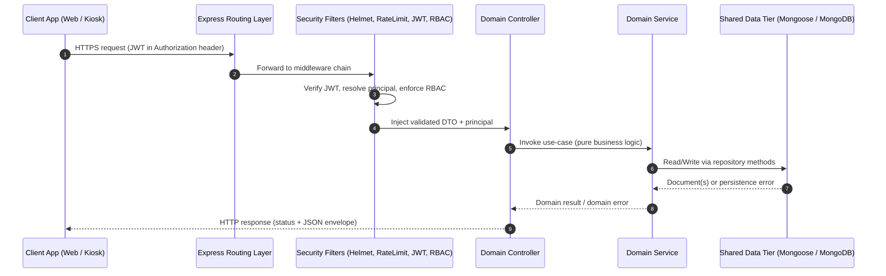
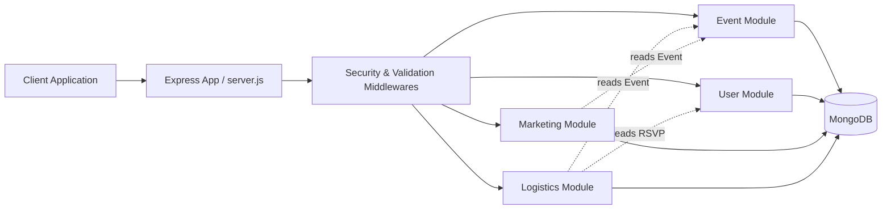

# College Event Management System
## Product Requirements Document (PRD) & Technical Design Document (TDD)

**Document Class:** Combined PRD + TDD
**Architecture Pattern:** Modular Monolith (Node.js / Express.js / MongoDB)
**Audience:** Engineering, Faculty Reviewers, External Code Reviewers
**Version:** 1.1 (Simplified — see §0 Scope Note)

---

## 0. SCOPE NOTE (v1.1)

This document targets a **college major project**, not a public production deployment. Concepts originally specified for an enterprise rollout — structured JSON logging with correlation IDs, request rate limiting, hand-rolled DB connect-retry loops, SIGTERM graceful shutdown, separate `/ready` probe, multi-tier observability — have been **intentionally removed** to keep the implementation simple, readable, and maintainable by a single student developer.

**What was kept** (genuinely load-bearing for correctness and security):
- `helmet`, `cors`, JSON body limit — one-line hardening at the HTTP boundary.
- `bcrypt` password hashing (cost ≥ 12) and JWT-based authentication.
- `DomainError` → uniform `{ success, data, error }` response envelope.
- `zod`-validated `.env` loader as the **single source of truth** for every credential and tunable.
- Mongoose schemas with the venue-conflict compound partial unique index.
- `morgan` dev-format request logger (human-readable terminal output).

**What was dropped** (and the rationale):
| Dropped | Reason |
|---|---|
| `pino` structured logging + correlation IDs | No log-aggregation pipeline; nobody is reading JSON in a college demo. |
| `express-rate-limit` | No public internet exposure, no abuse vector. |
| Mongo connect-retry loop with exponential backoff | Mongoose auto-reconnects; the retry layer added noise without value. |
| SIGTERM shutdown + force-kill timer | Ctrl-C is acceptable termination for the project. |
| `/ready` probe | `/health` is sufficient; no orchestrator distinguishes liveness from readiness here. |
| Jest + supertest + `mongodb-memory-server` | Manual smoke testing chosen for this scope; can be reintroduced any time. |
| ESLint + Prettier + Husky | Single-developer project; editor formatting is enough. |

These can each be reinstated later as a single small PR — none are entangled with business logic.

---

## 1. PRODUCT OVERVIEW & REQUISITES

### 1.1 Executive Summary
The College Event Management System (CEMS) is a centralized platform that allows students, organizing committees, and college administration to plan, publicize, attend, and secure on-campus events. The system is delivered as a **Modular Monolith** — a single deployable Node.js process internally decomposed into four strongly-bounded domain modules. This pattern keeps deployment, observability, and development overhead minimal (suited to a college project) while preserving clean separation of concerns and a clear future migration path to microservices.

### 1.2 Domain Modules

#### Module 1 — Event Planning & Scheduling
- **Responsibility:** Authoritative source of truth for all event entities.
- **Lifecycle States:** `DRAFT → PENDING_APPROVAL → APPROVED → PUBLISHED → ONGOING → COMPLETED → CANCELLED`. State transitions are linear and validated server-side; no client-supplied state mutations are honored except via documented transition endpoints.
- **Venue Conflict Prevention (First-Come-First-Served):** Bookings are serialized per venue. The first transaction to commit for a given `(venueId, time-range)` wins; any later request whose `[startTime, endTime)` **overlaps** an already-active booking is rejected with HTTP 409. Enforcement is two-layered: (a) a service-layer overlap query inside a MongoDB transaction, and (b) a defense-in-depth compound partial index on `(venueId, startTime, endTime)` that catches exact-triple duplicates even outside a transaction.
- **Calendar Generation:** Exposes range queries (`?from=…&to=…`) and a curated `/upcoming` feed.

#### Module 2 — Student & Management (Identity + RBAC)
- **Responsibility:** Authentication, authorization, profile management, RSVP tracking.
- **Roles (RBAC scopes):**
  - `STUDENT` — register, browse, RSVP, view tickets.
  - `ORGANIZER` — create/edit own events, view registrations.
  - `ADMIN` — approve/reject events, manage users, override allocations.
- **RSVP State Machine:** `REGISTERED → CONFIRMED → ATTENDED` plus terminal `CANCELLED`. Confirmation is bound to email-verification status.
- **Automated Verification:** Sign-up triggers a one-time, server-signed verification token (24h TTL). Unverified accounts are restricted to read-only event browsing.

#### Module 3 — Marketing & Promotion
- **Responsibility:** Discovery surface — announcements, notice board feeds, lightweight engagement metrics.
- **Targeted Announcement Payloads:** Each announcement carries a `targetAudience` descriptor (`department[]`, `year[]`, `role[]`). The query service computes the audience server-side; the wire payload contains only opaque IDs.
- **Notice Board Endpoint:** A stable, paginated JSON feed (`/api/v1/feed`) shaped for low-trust kiosk displays. Strict response schema, no joins on the read path — denormalized projections only.
- **Metrics:** Simple monotonic counters (`viewCount`, `rsvpCount`, `shareCount`) updated via `$inc`. No event-sourcing, no time-series DB.

#### Module 4 — Security & Logistics
- **Responsibility:** Gate-pass issuance, hardware/asset allocation, on-ground verification.
- **Crypto-Signed Digital Gate Pass:** Each pass is a JSON document signed with HMAC-SHA256 over a canonical projection (`{ passId, eventId, userId, issuedAt, expiresAt }`). The signature is embedded in the QR payload so a scanner can verify offline using the shared verifier key.
- **Asset Allocation:** Dynamic model — assets (projectors, mics, chairs-in-units) are reserved via decrement-on-demand with optimistic-concurrency (`__v`) guards to prevent double allocation.

### 1.3 Functional Requirements (per module)

| Module | FR ID | Requirement |
|---|---|---|
| Event | FR-E1 | Organizers can create events in `DRAFT`; only admins can promote to `APPROVED`. |
| Event | FR-E2 | System must reject any persisted event whose `(venue, time-range)` overlaps an active event. The earliest committed booking wins (FCFS); all later overlapping requests receive HTTP 409. |
| Event | FR-E3 | Events expose a transition endpoint that validates source→target legality. |
| User | FR-U1 | Passwords stored as `bcrypt` hashes with cost factor ≥ 12. |
| User | FR-U2 | JWT access tokens (15m) + refresh tokens (7d, rotated). |
| User | FR-U3 | RBAC middleware enforces role intersection on each protected route. |
| Marketing | FR-M1 | Notice board feed must return ≤ 50 items, sorted by `publishedAt DESC`. |
| Marketing | FR-M2 | Announcement targeting resolves audience server-side before delivery. |
| Logistics | FR-L1 | Gate passes are issued only for events the user has a `CONFIRMED` RSVP for. |
| Logistics | FR-L2 | Each gate pass signature is verifiable without a database round-trip. |
| Logistics | FR-L3 | Asset reservations are atomic — no oversubscription under concurrent load. |

### 1.4 Non-Functional Requirements

| NFR | Target |
|---|---|
| Performance | Sub-second responses on a local Atlas-backed dev machine for typical CRUD reads. (No formal p95 SLO at this scope.) |
| Security | `bcrypt` (cost ≥ 12) for passwords, JWT (HS256) for sessions, `helmet` default headers, `zod` request-body validation, **all secrets sourced from `.env`** — no hardcoded credentials anywhere in source. |
| Configuration | `.env` is the single source of truth. Changing the Mongo URI, JWT secret, bcrypt cost, port, or any other knob requires editing one file. `config/env.js` validates the whole shape at boot and fails fast on missing/malformed values. |
| Maintainability | Strict layer boundaries — controllers never touch Mongoose models directly; services never touch `req`/`res`. |
| Observability | `morgan` dev-format HTTP access logs to stdout; `console.error` for 5xx-class failures. |
| Reliability | Mongoose's built-in auto-reconnect. Process exits on fatal startup errors so a supervisor (e.g., `nodemon`) can restart it. |

---

## 2. HIGH-LEVEL DESIGN (HLD)

### 2.1 Request Lifecycle (Sequence)



### 2.2 Module Interaction (Flowchart)



Cross-module reads are mediated through **service interfaces** (not direct model imports), so the modules can later be extracted into separate processes without rewriting call sites.

---

## 3. LOW-LEVEL DESIGN (LLD) & MONGOOSE SCHEMAS

### 3.1 User Schema

```javascript
// models/user.model.js
const mongoose = require('mongoose');
const bcrypt = require('bcrypt');

const ROLES = Object.freeze(['STUDENT', 'ORGANIZER', 'ADMIN']);

const userSchema = new mongoose.Schema(
  {
    fullName: {
      type: String,
      required: [true, 'fullName is required'],
      trim: true,
      minlength: 2,
      maxlength: 80,
    },
    email: {
      type: String,
      required: true,
      unique: true,
      lowercase: true,
      trim: true,
      index: true,
      match: [/^[^\s@]+@[^\s@]+\.[^\s@]+$/, 'invalid email format'],
    },
    passwordHash: {
      type: String,
      required: true,
      select: false,
    },
    roles: {
      type: [{ type: String, enum: ROLES }],
      default: ['STUDENT'],
      validate: {
        validator: (arr) => Array.isArray(arr) && arr.length > 0,
        message: 'user must have at least one role',
      },
    },
    department: { type: String, trim: true },
    year: { type: Number, min: 1, max: 6 },
    isEmailVerified: { type: Boolean, default: false },
    rsvpedEvents: [
      { type: mongoose.Schema.Types.ObjectId, ref: 'Event', index: true },
    ],
    lastLoginAt: { type: Date },
  },
  { timestamps: true, versionKey: '__v' }
);

userSchema.index({ roles: 1 });

userSchema.statics.hashPassword = function (plain) {
  return bcrypt.hash(plain, 12);
};

userSchema.methods.verifyPassword = function (plain) {
  return bcrypt.compare(plain, this.passwordHash);
};

module.exports = mongoose.model('User', userSchema);
module.exports.ROLES = ROLES;
```

### 3.2 Event Schema (with FCFS Venue Conflict Guard)

**Strategy.** Two-layer defense:

1. **Service-layer transactional overlap check (primary).** Reserves the slot using the standard half-open overlap predicate `(existing.startTime < new.endTime) AND (existing.endTime > new.startTime)` inside a MongoDB transaction. Whichever transaction commits first claims the slot; the loser's commit fails or its pre-insert query observes the winner and aborts with `VENUE_CONFLICT`.
2. **Compound partial unique index (safety net).** Stops exact-triple duplicates even if a future code path bypasses the service.

```javascript
// services/event.service.js — first-come-first-served booking
const mongoose = require('mongoose');
const Event = require('../models/event.model');
const { DomainError } = require('../utils/domainError');

const ACTIVE_STATUSES = ['APPROVED', 'PUBLISHED', 'ONGOING'];

async function createEventFCFS(dto, organizerId) {
  if (!(dto.endTime > dto.startTime)) {
    throw new DomainError('INVALID_TIME_RANGE', 'endTime must be after startTime');
  }

  const session = await mongoose.startSession();
  try {
    let createdId;
    await session.withTransaction(async () => {
      // FCFS guard: any active event on this venue whose range overlaps ours?
      const conflict = await Event.findOne(
        {
          venueId: dto.venueId,
          status: { $in: ACTIVE_STATUSES },
          startTime: { $lt: dto.endTime },
          endTime: { $gt: dto.startTime },
        },
        { _id: 1 },
        { session }
      ).lean();

      if (conflict) {
        throw new DomainError('VENUE_CONFLICT', 'venue is already booked for this slot');
      }

      const [doc] = await Event.create(
        [{ ...dto, organizerId, status: 'PENDING_APPROVAL' }],
        { session }
      );
      createdId = doc._id;
    });
    return createdId;
  } catch (err) {
    if (err?.code === 11000) {
      // Index safety net fired — a concurrent writer beat us to it.
      throw new DomainError('VENUE_CONFLICT', 'venue is already booked for this slot');
    }
    throw err;
  } finally {
    session.endSession();
  }
}

module.exports = { createEventFCFS };
```

**Model:**

```javascript
// models/event.model.js
const mongoose = require('mongoose');

const EVENT_STATUS = Object.freeze([
  'DRAFT',
  'PENDING_APPROVAL',
  'APPROVED',
  'PUBLISHED',
  'ONGOING',
  'COMPLETED',
  'CANCELLED',
]);

const eventSchema = new mongoose.Schema(
  {
    title: { type: String, required: true, trim: true, maxlength: 160 },
    description: { type: String, required: true, maxlength: 4000 },
    organizerId: {
      type: mongoose.Schema.Types.ObjectId,
      ref: 'User',
      required: true,
      index: true,
    },
    venueId: {
      type: mongoose.Schema.Types.ObjectId,
      ref: 'Venue',
      required: true,
    },
    startTime: { type: Date, required: true },
    endTime: { type: Date, required: true },
    status: {
      type: String,
      enum: EVENT_STATUS,
      default: 'DRAFT',
      required: true,
      index: true,
    },
    capacity: { type: Number, required: true, min: 1, max: 10000 },
    rsvpCount: { type: Number, default: 0, min: 0 },
    viewCount: { type: Number, default: 0, min: 0 },
    tags: [{ type: String, trim: true, lowercase: true }],
    targetAudience: {
      departments: [{ type: String, trim: true }],
      years: [{ type: Number, min: 1, max: 6 }],
      roles: [{ type: String, enum: ['STUDENT', 'ORGANIZER'] }],
    },
  },
  { timestamps: true }
);

eventSchema.pre('validate', function (next) {
  if (this.endTime && this.startTime && this.endTime <= this.startTime) {
    return next(new Error('endTime must be strictly after startTime'));
  }
  next();
});

// Defense-in-depth: catches exact-triple duplicates outside the service path.
// True overlap-FCFS is enforced by the transactional service above.
eventSchema.index(
  { venueId: 1, startTime: 1, endTime: 1 },
  {
    unique: true,
    partialFilterExpression: {
      status: { $in: ['APPROVED', 'PUBLISHED', 'ONGOING'] },
    },
    name: 'uniq_active_venue_slot',
  }
);

eventSchema.index({ status: 1, startTime: 1 });

module.exports = mongoose.model('Event', eventSchema);
module.exports.EVENT_STATUS = EVENT_STATUS;
```

### 3.3 Logistics / GatePass Schema

```javascript
// models/gatePass.model.js
const mongoose = require('mongoose');
const crypto = require('crypto');

const PASS_STATUS = Object.freeze(['ISSUED', 'CONSUMED', 'REVOKED', 'EXPIRED']);

const gatePassSchema = new mongoose.Schema(
  {
    passId: {
      type: String,
      required: true,
      unique: true,
      index: true,
      default: () => crypto.randomUUID(),
    },
    txnTrackId: {
      type: String,
      required: true,
      unique: true,
      index: true,
      default: () => `TXN-${Date.now()}-${crypto.randomBytes(4).toString('hex')}`,
    },
    eventId: {
      type: mongoose.Schema.Types.ObjectId,
      ref: 'Event',
      required: true,
      index: true,
    },
    userId: {
      type: mongoose.Schema.Types.ObjectId,
      ref: 'User',
      required: true,
      index: true,
    },
    issuedAt: { type: Date, default: Date.now, required: true },
    expiresAt: { type: Date, required: true },
    status: {
      type: String,
      enum: PASS_STATUS,
      default: 'ISSUED',
      required: true,
    },
    signature: { type: String, required: true },
    allocatedAssets: [
      {
        assetId: { type: mongoose.Schema.Types.ObjectId, ref: 'Asset' },
        quantity: { type: Number, min: 1 },
      },
    ],
    consumedAt: { type: Date },
  },
  { timestamps: true }
);

gatePassSchema.index({ userId: 1, eventId: 1 }, { unique: true });

gatePassSchema.statics.computeSignature = function (payload, secret) {
  const canonical = JSON.stringify({
    passId: payload.passId,
    eventId: String(payload.eventId),
    userId: String(payload.userId),
    issuedAt: new Date(payload.issuedAt).toISOString(),
    expiresAt: new Date(payload.expiresAt).toISOString(),
  });
  return crypto.createHmac('sha256', secret).update(canonical).digest('hex');
};

module.exports = mongoose.model('GatePass', gatePassSchema);
module.exports.PASS_STATUS = PASS_STATUS;
```

---

## 4. PROJECT ARCHITECTURE & DIRECTORY BLUEPRINT

```
cems-backend/
├── server.js                       # Process entry — connect db, then app.listen()
├── app.js                          # Express app factory — helmet, cors, json, morgan, routes
├── package.json
├── .env                            # Single source of truth for all config (gitignored)
├── .env.example                    # Documented env contract committed to repo
│
├── config/                         # Pure configuration — no business logic
│   ├── env.js                      # zod-validated loader; process.env touched ONLY here
│   └── db.js                       # mongoose.connect() + clean disconnect
│
├── middleware/                     # Cross-cutting HTTP concerns
│   ├── auth.middleware.js          # JWT verify → attaches req.principal              (Phase 2)
│   ├── rbac.middleware.js          # requireRoles('ADMIN', 'ORGANIZER') factory        (Phase 2)
│   ├── validate.middleware.js      # zod schema validation wrapper                     (Phase 2)
│   └── error.middleware.js         # Central error → uniform JSON envelope translator
│
├── routes/                         # HTTP surface — thin: path → controller binding only
│   ├── index.js                    # Mounts feature routers under API_PREFIX (from .env)
│   ├── health.routes.js
│   ├── auth.routes.js                                                                  (Phase 2)
│   ├── event.routes.js                                                                 (Phase 2)
│   ├── marketing.routes.js                                                             (Phase 2)
│   └── logistics.routes.js                                                             (Phase 3)
│
├── controllers/                    # HTTP adapter — parses req, calls service, shapes response (Phase 2)
│   ├── auth.controller.js
│   ├── event.controller.js
│   ├── marketing.controller.js
│   └── logistics.controller.js
│
├── services/                       # Pure business logic — no req/res; throws DomainError (Phase 2)
│   ├── auth.service.js
│   ├── event.service.js            # Lifecycle transitions, FCFS overlap guard
│   ├── marketing.service.js        # Audience resolution, feed projection
│   └── logistics.service.js        # Gate-pass signing, asset reservation
│
├── models/                         # Mongoose schemas — single source of persistence truth
│   ├── user.model.js
│   ├── event.model.js
│   ├── venue.model.js
│   ├── asset.model.js                                                                  (Phase 3)
│   ├── announcement.model.js                                                           (Phase 2)
│   └── gatePass.model.js                                                               (Phase 3)
│
└── utils/                          # Stateless helpers (no I/O)
    ├── domainError.js              # Typed error class with httpStatus mapping
    ├── jwt.js                      # sign/verify wrappers                              (Phase 2)
    └── asyncHandler.js             # Promise → next(err) adapter
```

Files marked *(Phase 2)* / *(Phase 3)* do not exist yet — they are scheduled in the roadmap. The Phase 1 tree contains exactly: `server.js`, `app.js`, `config/{env,db}.js`, `middleware/error.middleware.js`, `routes/{index,health.routes}.js`, `models/{user,venue,event}.model.js`, `utils/{domainError,asyncHandler}.js`.

**Layer contract (enforced by convention + lint rules):**
- `routes/` may import only `controllers/` and `middleware/`.
- `controllers/` may import only `services/`, `utils/`, and validation schemas.
- `services/` may import only `models/` and `utils/`.
- `models/` import nothing from inner layers — they are leaf nodes.

---

## 5. RESTful API ENDPOINT SPECIFICATION

| HTTP | Route Path | Auth / RBAC | Technical Objective |
|---|---|---|---|
| `POST` | `/api/v1/auth/register` | Public | Create a `STUDENT` account; bcrypt-hash password (cost 12); emit verification token. |
| `POST` | `/api/v1/auth/login` | Public | Verify credentials; issue 15-min JWT access token + rotating refresh token. |
| `POST` | `/api/v1/events` | JWT + `ORGANIZER` \| `ADMIN` | Create event; FCFS booking — transactional overlap check on `(venueId, [startTime,endTime))` rejects any later overlapping request with HTTP 409. |
| `PATCH` | `/api/v1/events/:id/status` | JWT + `ADMIN` | Transition event state; validates source→target legality through service-layer state machine. |
| `GET` | `/api/v1/feed?dept=&year=` | JWT + any role | Notice-board projection; returns ≤ 50 denormalized announcement items, audience-filtered. |
| `POST` | `/api/v1/logistics/gate-pass` | JWT + `STUDENT` (self) \| `ADMIN` | Issue HMAC-SHA256-signed gate pass, only if caller has `CONFIRMED` RSVP for the event. |

**Response Envelope (uniform):**
```json
{ "success": true, "data": { ... }, "error": null, "correlationId": "..." }
```

---

## 6. STRATEGIC EXECUTION ROADMAP

### Phase 1 — Foundations  *(Week 1–2)*  ✅ COMPLETE
- Initialize repository and `package.json`.
- Stand up `app.js` / `server.js` split.
- `config/env.js` — `zod`-validated loader; **`.env` is the single source of truth** for every credential and tunable (Mongo URI, JWT secrets, bcrypt cost, port, API prefix, CORS origin, body limit, gate-pass HMAC).
- `config/db.js` — `mongoose.connect()` using values from env; relies on Mongoose's built-in auto-reconnect.
- Core middlewares: `helmet`, `cors` (origin from env), `express.json` (limit from env), `morgan` (dev format), central error translator producing `{ success, data, error }` envelopes.
- Mongoose models: `User` (bcrypt cost from env, role enum), `Venue`, `Event` (lifecycle enum + compound partial unique index on `(venueId, startTime, endTime)` for ACTIVE statuses).
- `DomainError` utility with code → HTTP-status mapping.
- Acceptance gate: `npm run dev` connects to Atlas (or local Mongo per `.env`) and `GET /api/v1/health` returns `{ success: true, data: { status: "ok", uptime: <number> } }`.

### Phase 2 — Data Validation & RBAC Access  *(Week 3–4)*
- Implement JWT auth flow (register, login, refresh) with `bcrypt` cost from `.env`.
- Build `auth.middleware.js` and the `requireRoles()` factory.
- Write `zod` schemas for every request DTO; wire `validate.middleware.js`.
- Deliver event CRUD + lifecycle transition endpoint with the service-layer state machine and the **FCFS transactional overlap guard** from §3.2.
- Acceptance gate: manual smoke walkthrough — register → login → create event → conflict attempt → admin transition — exercised end-to-end against the running server (Postman / `curl` / Thunder Client).

### Phase 3 — Conflict Guard & Logistics  *(Week 5–6)*
- **FCFS concurrency check:** manual script that fires N parallel `POST /events` for *overlapping* `(venue, time-range)` slots; assert exactly one succeeds and the rest receive HTTP 409. Include a non-overlapping control case (e.g., 10–11 and 11–12 on the same venue) which must both succeed (half-open interval semantics).
- Implement gate-pass signing (HMAC secret from `.env`) + offline verifier; QR payload sample fixtures.
- Asset reservation with optimistic concurrency (`__v` guard).
- Rotate the demo Atlas credentials and verify nothing in source references them directly — every reach must go through `config/env.js`.
- Acceptance gate: end-to-end demo flow — student registers, RSVPs, organizer creates event, admin approves, gate pass is issued, QR signature verifies offline.

---

**End of Document.**
